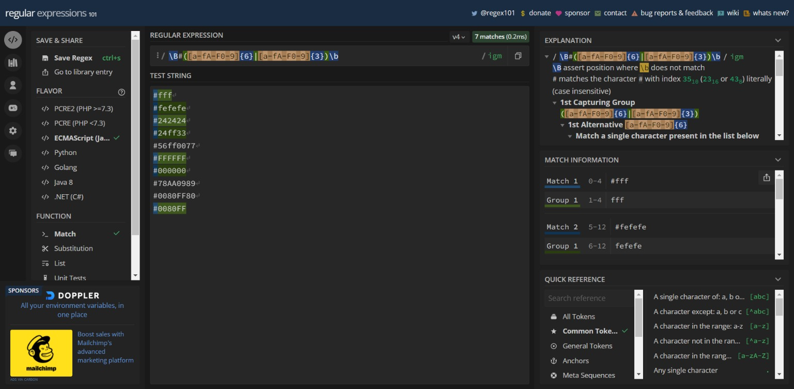

# RegEx-Hex Values

## Description
A gist for a hex value regex.    

regex101.com used for testing and img purposes

## Table of Contents:

**[How to Use](#how-to-use)**  
**[Application Demos](#application-demos)**  
**[Link to Deployed Page](#link-to-deployed-page)**  
**[References](#references)**  

**[Author](#author)**  

## How to Use:
Visit gist page linked below

## Link to Deployed Page:
https://gist.github.com/jacef790/6aa0e4d9ead4ab43219678a80d274277

## References:
Adegeo. (n.d.). Regular expression language - Quick reference. Developer tools, technical documentation and coding examples | Microsoft Docs. https://docs.microsoft.com/en-us/dotnet/standard/base-types/regular-expression-language-quick-reference

Fox, J. (2022, May 6). Regex tutorial — a quick cheatsheet by examples. Medium. https://medium.com/factory-mind/regex-tutorial-a-simple-cheatsheet-by-examples-649dc1c3f285

Regular expressions. (2021, September 4). MDN Web Docs. https://developer.mozilla.org/en-US/docs/Web/JavaScript/Guide/Regular_Expressions

## Author

Jace Feinstein. Find me at https://github.com/jacef790

